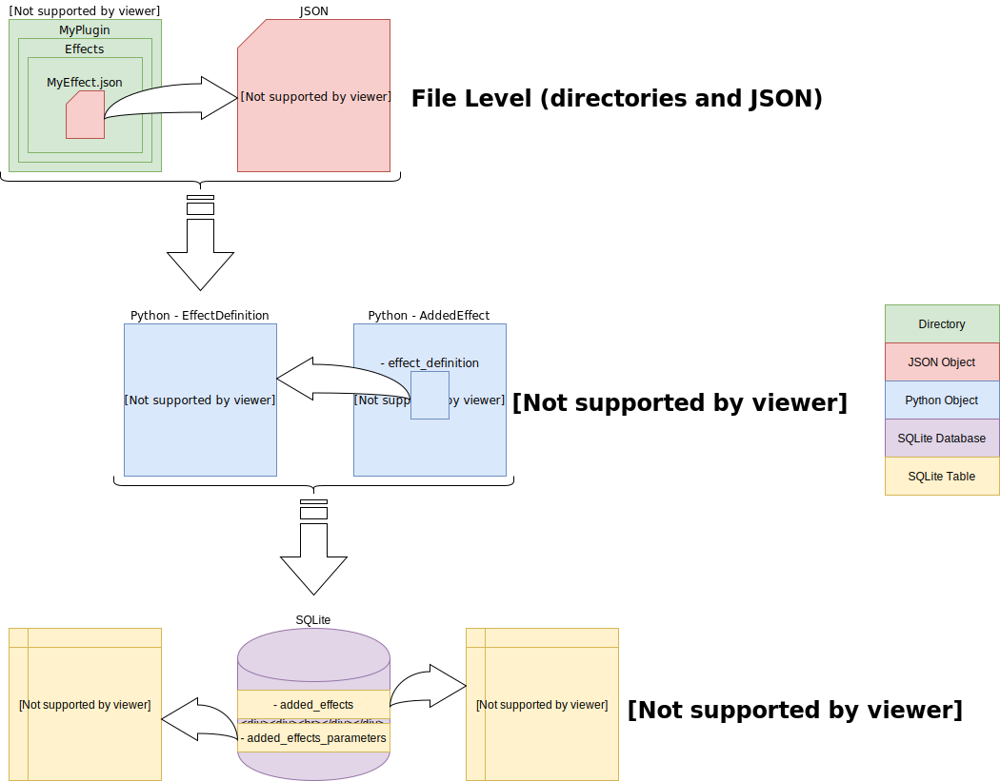

# OceanFloor Video Effects

## Description

Effects are video editing functions that the user chooses to add to the video in a certain order. The effects will be rendered at the same order at render time. [Plugin](./plugins.md) makers can create plugins that define new effects, using JSON objects; OceanFloor deserializes these objects into Python [`EffectDefinition`](./classes.md#effectdefinition) objects.

The effect definition isn't enough: additional parameters are sometimes needed to render the actual effect.
Interaction with the user in order to get that information is achieved through an [`AddEffectDialog`](./classes.md#effectrundialog) with [`EffectControl`](./classes.md#effectcontrol) objects positioned on it. Each of the `EffectControl` objects has one or more properties that are linked to named parameters specified by the `EffectDefinition`'s `magic` attribute.

[OceanFloor save files](./save-file-structure.md) are later used to save the added effects in two SQL tables: one for the actual effects (ordering, plugin, filename) and another for the parameters chosen by the user for each effect, linked to effects from the first table by an `effect_id`.

---

**[Back to the Documentation](documentation.md)**

**[Back to the README](../readme.md)**
