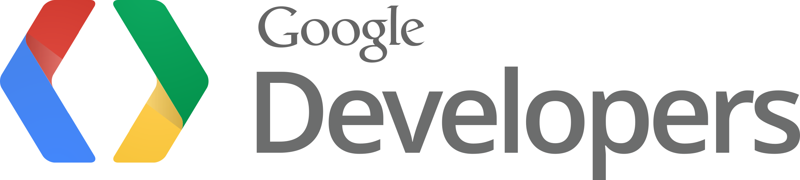
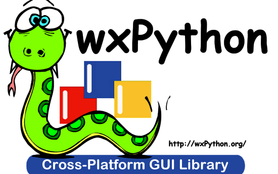

# External Python Modules Used by OceanFloor

## Google API

##### As Officially Described

> The Google API Client for Python is a client library for accessing the Plus, Moderator, and many other Google APIs.

##### PIP Packages

- `google-api-python-client`
- `google-auth`
- `google-auth-oauthlib`
- `google-auth-httplib2`

##### Used For...

Making the requests to the [YouTube Data API](./external-tools.md#youtube-data-api).

##### Links

- [YouTube Data API - Python Quickstart](https://developers.google.com/youtube/v3/quickstart/python)

## wxPython

##### As Officially Described

> wxPython is a cross-platform GUI toolkit for the Python programming language. It allows Python programmers to create programs with a robust, highly functional graphical user interface, simply and easily.

##### PIP Packages

- `wxpython`

##### Used For...

OceanFloor's graphical user interface.

##### Links

- [Home Page](https://wxpython.org/)

---

**[Back to the Documentation](documentation.md)**

**[Back to the README](../readme.md)**
